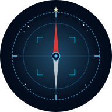
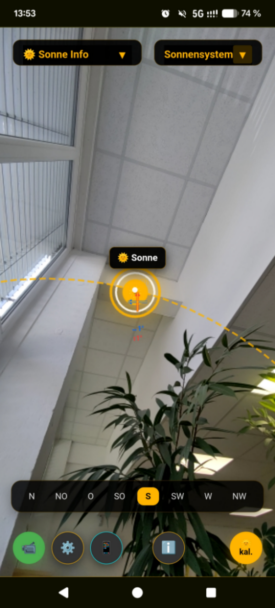
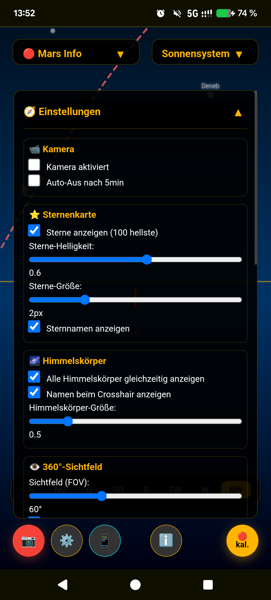
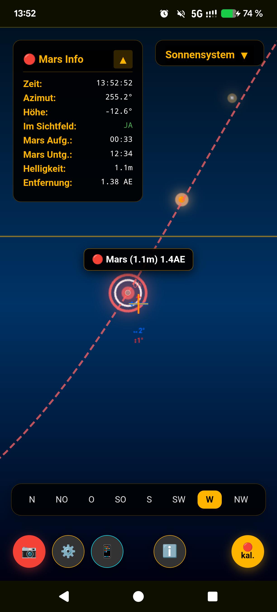

# 🌌 AR Himmelsnavigator

**Augmented-Reality-Himmelsnavigation direkt im mobilen Browser**

Ein webbasierter Augmented-Reality-Himmelsnavigator, der direkt im mobilen Browser läuft. Die App nutzt die Kamera, das Gyroskop und den Kompass des Smartphones, um Planeten, die Sonne, den Mond und spezielle Satelliten live am Himmel zu finden.

---

> **Hintergrund & Motivation:**
> Dieses Projekt wurde mit **Gemini 3.1 Pro Thinking** erstellt. Mein persönlicher Wunsch und Hauptantrieb für diese App war es, den **Europa Clipper Satelliten** einfach und präzise mit dem Handy am Himmel orten zu können, um genau zu wissen, wo er sich befindet – vor allem, um ihn meinen Kindern zu zeigen und den Weltraum greifbar zu machen! 🚀🛰️

---

## 🖼️ Vorschau

  <!-- Ersetze diese Pfade mit echten Screenshots, sobald du welche in den Repo-Ordner /images lädst -->
  
  
  

*(Füge 3 Screenshots in einen Ordner `images/` ein und benenne sie entsprechend, um hier eine Vorschau zu generieren)*

---

## 🚀 Hauptfunktionen

* **Satelliten- & Planeten-Tracking:** Finde den Europa Clipper, alle Planeten unseres Sonnensystems, Sonne und Mond.
* **AR-Kamera-Ansicht:** Die Himmelskörper werden in Echtzeit über das Live-Kamerabild deines Smartphones gelegt.
* **3D-Navigationspfeil:** Zeigt dir genau an, in welche Richtung (Azimut und Höhe) du das Handy schwenken musst, um das ausgewählte Objekt zu finden.
* **Lokale Berechnung:** Nutzt die `SunCalc`-Bibliothek zur Berechnung der Ephemeriden – keine ständigen API-Anfragen an die NASA nötig.
* **Sternenkarte:** Zeigt optional die 100 hellsten Sterne zur besseren Orientierung am Nachthimmel.
* **Gimbal Lock Protection:** Stabilisiert den Kompass, wenn das Handy steil nach oben oder unten gehalten wird.
* **Smarte Initialisierung:** Nach dem AR-Start benötigt die App kurz etwa 3–5 Sekunden, um die tatsächlichen Standorte zu berechnen, anzuzeigen und zu aktualisieren.
* **Browser-Kompatibilität:** In Chromium-basierten Browsern wird der moderne Sensor-Modus verwendet; in Firefox und anderen nicht-Chromium-basierten Browsern greift automatisch ein Legacy-Modus für Kompass- und Bewegungssensoren.

---

## 📱 Nutzung auf dem Smartphone

Da die App auf sensible Hardware zugreift, müssen folgende Dinge beachtet werden:

1. **HTTPS ist Pflicht:** Die App muss über eine sichere Verbindung geladen werden (GitHub Pages macht das automatisch).
2. **Berechtigungen:** Beim ersten Start fragt die App nach dem Zugriff auf **Kamera, Standort und Bewegungssensoren**. Diese müssen zwingend erlaubt werden, damit die AR-Funktion und der Kompass arbeiten können.
3. Auf dem iPhone (Safari) muss der Start der Sensoren durch einen aktiven Klick des Nutzers ausgelöst werden (über den "AR Starten"-Button).

---

## 🛠️ Installation / Lokale Ausführung

Das Projekt besteht im Kern aus einer einzigen Datei. Es werden keine Build-Tools oder Frameworks wie React/Vue benötigt.

1. Repository klonen: `git clone https://github.com/basecore/ar-himmelsnavigator.git`
2. Die Datei `index.html` über einen lokalen Webserver bereitstellen (z.B. mit VS Code Live Server), um Kamera- und Sensor-APIs lokal testen zu können.

> 💡 *Hinweis: Direktes Öffnen der Datei aus dem Dateisystem (`file://...`) blockiert im Browser aus Sicherheitsgründen oft den Kamera- und Sensorzugriff.*

---

## 📜 Lizenz

Dieses Projekt ist für den privaten Gebrauch und die Bildung gedacht. Viel Spaß beim Sterne und Satelliten schauen!

---

  🤖 <i>Dieses Projekt, die Code-Architektur und die Dokumentation wurden mit KI-Unterstützung erstellt, erweitert und optimiert.</i>

